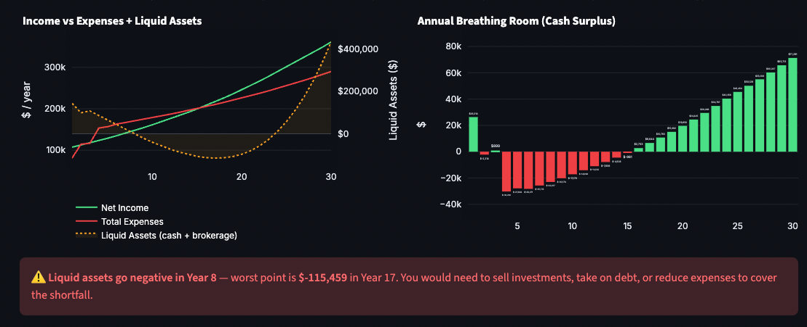

# 📈 fintracker

> **Personal long-term financial planning — tax-aware, scenario-driven, Monte Carlo enabled.**

A self-hosted Streamlit app and Python library for people who want to understand where their money is *actually* going — and where it's headed.

[](https://www.python.org/)
[](LICENSE)
[](tests/)

---

## Why fintracker?

Most free financial tools give you a single-number answer. fintracker gives you *understanding*:

| Feature | fintracker | Typical Free Tool |
|---|---|---|
| Full amortization schedule (exact math) | ✅ | ❌ Simplified |
| Multi-state income tax engine | ✅ GA, CA, NY, TX, FL, WA, IL, NC, VA, CO | ❌ |
| FICA + Additional Medicare Tax | ✅ | ❌ |
| HSA saves FICA *and* income tax (correctly) | ✅ | ❌ |
| 401k vs Roth vs HSA strategy comparison | ✅ | ❌ |
| 529 state deduction by state | ✅ | ❌ |
| College costs with 529 drawdown + AOTC credit | ✅ | ❌ |
| Retirement readiness analysis | ✅ | Rare |
| Dual income with independent salary growth | ✅ | ❌ |
| Stop/resume work (sabbatical, caregiving) | ✅ | ❌ |
| Parent care costs with timeline events | ✅ | ❌ |
| PMI with automatic removal at 80% LTV | ✅ | ❌ |
| Monte Carlo simulation (1,000 runs) | ✅ | Rare |
| Timeline events (marriage, children, raise) | ✅ | ❌ |
| YAML config — reproducible, git-friendly | ✅ | N/A |
| 100% local — your data never leaves your machine | ✅ | ❌ |
| Open source, hackable | ✅ | ❌ |

---

## Screenshots



---

## Quick Start

```bash
# 1. Clone
git clone https://github.com/rishigurnani/fintracker.git
cd fintracker

# 2. Install (tested with python3.11)
pip install -e ".[dev]"

# 3. Copy sample config and fill in your real numbers
cp config/sample.yaml config/personal.yaml
# Edit config/personal.yaml — it's gitignored, so your data stays private

# 4. Run
streamlit run app.py
```

Your browser will open at `http://localhost:8501`.

---

## Configuration

All personal data lives in `config/personal.yaml`, which is **gitignored** — it will never be accidentally committed. A fully documented sample with all available options is in [`config/sample.yaml`](config/sample.yaml).

### Minimal example

```yaml
projection_years: 30

income:
  gross_annual_income: 120000
  filing_status: single   # single | married_filing_jointly | head_of_household
  state: GA               # GA | CA | NY | TX | FL | WA | IL | NC | VA | CO | OTHER

housing:
  is_renting: false
  home_price: 400000
  down_payment: 80000
  interest_rate: 0.065

investments:
  current_liquid_cash: 100000
  annual_401k_contribution: 23000
  annual_hsa_contribution: 4150
  annual_market_return: 0.08

strategies:
  maximize_hsa: true
  maximize_401k: true

timeline_events:
  - year: 3
    description: "Get married"
    marriage: true
  - year: 4
    description: "First child"
    new_child: true
```

### Retirement readiness example

Add a `retirement:` block to get an on-track/off-track analysis in the Projections tab:

```yaml
retirement:
  current_age: 32
  retirement_age: 65
  # Desired spending in TODAY'S dollars — engine inflates to nominal
  desired_annual_income: 80000
  years_in_retirement: 30
  # Post-retirement return (typically more conservative than accumulation phase)
  expected_post_retirement_return: 0.05
  # Your SSA estimate in today's dollars. Set to 0 to be conservative.
  estimated_social_security_annual: 24000
```

The engine computes:
- **Projected balance** at retirement year (retirement + brokerage + HSA)
- **Required balance** = present value of annuity to fund `desired_annual_income` (inflated) minus Social Security, for `years_in_retirement` years at `expected_post_retirement_return`
- **Funded %** and **annual surplus or gap** in retirement-year dollars

### College costs example

Add a `college:` block to model 529 drawdowns and the AOTC credit:

```yaml
college:
  annual_cost_per_child: 35000  # tuition + room & board in TODAY'S dollars
  years_per_child: 4
  start_age: 18
  use_aotc_credit: true         # up to $2,500/student/yr, first 4 years

# Track birth years with child_birth_year_override for children already born:
timeline_events:
  - year: 1
    description: "Existing child (born 2 years ago)"
    new_child: true
    child_birth_year_override: -2
```

529 balances draw down tax-free in college years; any shortfall comes from brokerage. AOTC phases out at $80k–$90k (single) or $160k–$180k (MFJ) and is applied as a direct tax credit.

### Stop/resume work example

```yaml
timeline_events:
  - year: 4
    description: "Sabbatical year"
    stop_working: true
  - year: 5
    description: "Return to work at new employer"
    resume_working: true
    income_change: 145000       # new salary after returning
```

While stopped, income is zero and salary growth is paused — no phantom compounding during time off. Growth resumes from the new stated salary.

### Parent care example

```yaml
lifestyle:
  annual_parent_care_cost: 18000   # in today's dollars; inflates with inflation

timeline_events:
  - year: 8
    description: "Mom needs in-home care"
    start_parent_care: true
  - year: 14
    description: "Mom transitions to assisted living (separate account)"
    stop_parent_care: true
```

### Dual income example

```yaml
income:
  gross_annual_income: 150000
  spouse_gross_annual_income: 90000
  filing_status: married_filing_jointly

investments:
  annual_salary_growth_rate: 0.04
  partner_salary_growth_rate: 0.06    # partner on a faster track
  annual_401k_contribution: 23000
  partner_annual_401k_contribution: 20000   # each person has their own IRS limit

timeline_events:
  - year: 3
    description: "Partner promotion"
    partner_income_change: 120000
```

---

## Features In Depth

### 🧮 Tax Engine

- **2024/2025 federal brackets** — MFJ, Single, Head of Household
- **FICA** — Social Security (capped at $168,600 wage base), Medicare (1.45%), Additional Medicare Tax (0.9% above $200k/$250k)
- **HSA** — reduces Federal + FICA + State (except California)
- **401k** — reduces Federal + State (not FICA — correct)
- **AOTC** — American Opportunity Tax Credit applied as a direct reduction to effective tax; correct phase-out by filing status
- **State taxes** — progressive or flat, state-specific standard deductions, 529 deduction rules per state

### 🏠 Mortgage Calculator

Exact amortization (not approximations):
- Month-by-month P&I split
- PMI charged while LTV > 80%, automatically removed
- Home value appreciation applied each year
- Full schedule with cumulative interest, equity, and home value
- Configurable buyer and seller closing costs on purchase/sale events

### 🎓 College Planning

- 529 balance tracked separately, grows at the same market return as other accounts
- In college years, 529 draws down first (tax-free); remainder hits brokerage
- AOTC: up to $2,500/student/year for first 4 years; correct income phase-out
- Multiple children tracked independently with their own birth years and college windows
- `annual_529_contribution` applies per child × number of children

### 🛡️ Retirement Readiness

- Present-value-of-annuity math to determine required lump sum at retirement
- Desired income inflated from today's dollars to nominal retirement-year dollars
- Social Security offset reduces the required balance
- Reports: projected vs required balance, funded %, and annual surplus or gap

### 🎯 Strategy Analyzer

Quantifies the dollar value of each tax strategy in isolation:
- HSA: "Contributing $4,150 saves ~$1,537/yr in Federal + FICA + State taxes"
- 401k: "Contributing $23,000 saves ~$6,397/yr in Federal + State taxes"
- 529: "Deducting $8,000 for 1 child saves ~$431/yr in Georgia state tax"
- Roth IRA eligibility and phase-out detection

### 📈 Projections

Year-by-year simulation over up to 40 years, tracking:
- Gross income, taxes, net income, breathing room
- Retirement balance (grows at `annual_market_return`, funded by 401k contributions)
- Brokerage / liquid assets
- 529 balance (contributions, growth, college drawdowns)
- Home equity and mortgage balance
- HSA balance
- All expenses: housing, lifestyle, medical, childcare, parent care, college costs

Single source of truth: all tabs (Cash Flow, Projections, Strategy) read from the same year-1 projection snapshot — the waterfall chart, monthly KPIs, and projection table always show consistent numbers.

### 🎲 Monte Carlo

1,000 simulations with randomized:
- **Market returns**: N(μ=your assumption, σ=15%)
- **Inflation**: N(μ=your assumption, σ=1.5%), clipped to [0%, 15%]
- **Salary growth**: N(μ=your assumption, σ=2%)

Outputs p10/p25/p50/p75/p90 net worth bands, probability of $1M by year 10, and comparison of deterministic vs median outcome.

---

## Timeline Events Reference

All fields are optional unless noted. Multiple events can fire in the same year.

| Field | Type | Description |
|---|---|---|
| `year` | int | **Required.** Fires at the start of this projection year |
| `description` | str | **Required.** Label shown in the UI |
| `marriage` | bool | Switches to MFJ filing, upgrades HSA to family limit, scales medical costs |
| `new_child` | bool | Increments child count; activates childcare and 529 contributions |
| `child_birth_year_override` | int | Birth year offset for college cost timing (negative = already born) |
| `new_pet` | bool | Increments pet count |
| `income_change` | float | New gross income for primary person |
| `partner_income_change` | float | New gross income for partner |
| `stop_working` | bool | Primary income → 0; salary growth paused |
| `resume_working` | bool | Primary resumes; pair with `income_change` for new salary |
| `partner_stop_working` | bool | Partner income → 0 |
| `partner_resume_working` | bool | Partner resumes; pair with `partner_income_change` |
| `start_parent_care` | bool | Activates `annual_parent_care_cost` from lifestyle |
| `stop_parent_care` | bool | Deactivates parent care cost |
| `buy_home` | bool | Purchases a new home; optionally sells current |
| `sell_current_home` | bool | Captures equity (minus seller closing costs) into brokerage |
| `buyer_closing_cost_rate` | float | Default 0.02 (2% of purchase price) |
| `seller_closing_cost_rate` | float | Default 0.06 (6% of sale price) |
| `extra_one_time_expense` | float | One-time cash outflow (drains brokerage) |
| `extra_one_time_income` | float | One-time cash inflow (adds to brokerage) |

---

## Running Tests

```bash
pytest tests/ -v --tb=short
```

The test suite covers all financial logic with explicit regression tests for every known bug. See [`CONTRIBUTING.md`](CONTRIBUTING.md) for the full list of documented regressions and rules for adding new tests.

```
tests/
├── test_accounting.py      # Core projection engine regressions
├── test_new_features.py    # Retirement readiness, stop/resume, college, parent care
├── test_tax_engine.py      # Federal + state tax math
├── test_mortgage.py        # Amortization, PMI, payment calculations
├── test_projections.py     # Projection engine behaviours
├── test_strategies.py      # Strategy analyzer
└── test_config.py          # YAML round-trip serialization
```

---

## Project Structure

```
fintracker/
├── app.py                  # Streamlit UI (single source of truth for all tabs)
├── fintracker/
│   ├── models.py           # Dataclasses: FinancialPlan, RetirementProfile,
│   │                       #   CollegeProfile, TimelineEvent, etc.
│   ├── tax_engine.py       # Federal + multi-state tax
│   ├── mortgage.py         # Exact amortization schedule
│   ├── strategies.py       # HSA, 401k, 529, Roth strategy analyzer
│   ├── projections.py      # Deterministic + Monte Carlo engine;
│   │                       #   RetirementReadiness computation
│   └── config.py           # YAML load/save
├── tests/
├── config/
│   ├── sample.yaml         # ✅ Tracked — fully documented example
│   └── personal.yaml       # 🔒 Gitignored — your private numbers
├── CONTRIBUTING.md         # Rules for contributors and AI assistants
├── pyproject.toml
└── .gitignore
```

---

## Using fintracker as a Library

The core engine is decoupled from Streamlit:

```python
from fintracker.models import *
from fintracker.projections import ProjectionEngine

plan = FinancialPlan(
    income=IncomeProfile(150_000, FilingStatus.SINGLE, State.GEORGIA),
    housing=HousingProfile(0, 0, 0.0, is_renting=True, monthly_rent=1_800),
    lifestyle=LifestyleProfile(annual_vacation=8_000, annual_medical_oop=3_000),
    investments=InvestmentProfile(
        current_liquid_cash=80_000,
        current_retirement_balance=120_000,
        annual_401k_contribution=23_000,
        annual_market_return=0.08,
    ),
    strategies=StrategyToggles(maximize_401k=True, maximize_hsa=True),
    retirement=RetirementProfile(
        current_age=33, retirement_age=65,
        desired_annual_income=90_000,
        estimated_social_security_annual=24_000,
    ),
    college=CollegeProfile(annual_cost_per_child=35_000, use_aotc_credit=True),
    timeline_events=[
        TimelineEvent(year=2, description="Buy home", buy_home=True,
                      new_home_price=550_000, new_home_down_payment=110_000,
                      new_home_interest_rate=0.068, sell_current_home=False),
        TimelineEvent(year=3, description="Get married", marriage=True),
        TimelineEvent(year=4, description="First child", new_child=True),
    ],
    projection_years=30,
)

engine = ProjectionEngine(plan)
snapshots = engine.run_deterministic()

print(f"Year 30 net worth: ${snapshots[-1].net_worth:,.0f}")

# Retirement readiness
rr = engine.compute_retirement_readiness(snapshots)
status = "✅ On track" if rr.on_track else "⚠️ Off track"
print(f"{status} — {rr.funded_pct:.0%} funded")
print(f"Projected at retirement: ${rr.projected_balance_at_retirement:,.0f}")
print(f"Required: ${rr.required_balance:,.0f}")

# Monte Carlo
mc = engine.run_monte_carlo(n_simulations=1_000, seed=42)
print(f"Median net worth year 30: ${mc.p50_net_worth[-1]:,.0f}")
print(f"Probability of $1M by year 10: {mc.prob_millionaire_10yr:.1%}")
```

---

## Supported States

| State | Tax Type | HSA Deduction | 529 Deduction |
|---|---|---|---|
| Georgia (GA) | Flat 5.39% | ✅ | ✅ $8k/beneficiary (MFJ) |
| California (CA) | Progressive | ❌ | ❌ |
| New York (NY) | Progressive | ✅ | ✅ $5k/beneficiary |
| Texas (TX) | None | N/A | N/A |
| Florida (FL) | None | N/A | N/A |
| Washington (WA) | None | N/A | N/A |
| Illinois (IL) | Flat 4.95% | ✅ | ✅ $10k/beneficiary |
| North Carolina (NC) | Flat 4.5% | ✅ | ❌ |
| Virginia (VA) | Progressive | ✅ | ❌ |
| Colorado (CO) | Flat 4.4% | ✅ | ✅ $20k/beneficiary |

> **Disclaimer:** Tax laws change annually. This tool is for planning and scenario analysis — not tax advice. Consult a CPA or financial advisor for your specific situation.

---

## Roadmap

- [ ] Retirement readiness section in Projections tab UI (display `RetirementReadiness`)
- [ ] Backdoor Roth IRA modelling
- [ ] Scenario A vs B side-by-side comparison
- [ ] Rent vs Buy breakeven analysis
- [ ] Export to PDF report
- [ ] More states

---

## Contributing

PRs welcome. Read [`CONTRIBUTING.md`](CONTRIBUTING.md) before making changes — it documents the architectural rules and every known regression with its corresponding test.

```bash
pytest tests/ -v --tb=short
```

---

## License

MIT — use it, fork it, build on it.